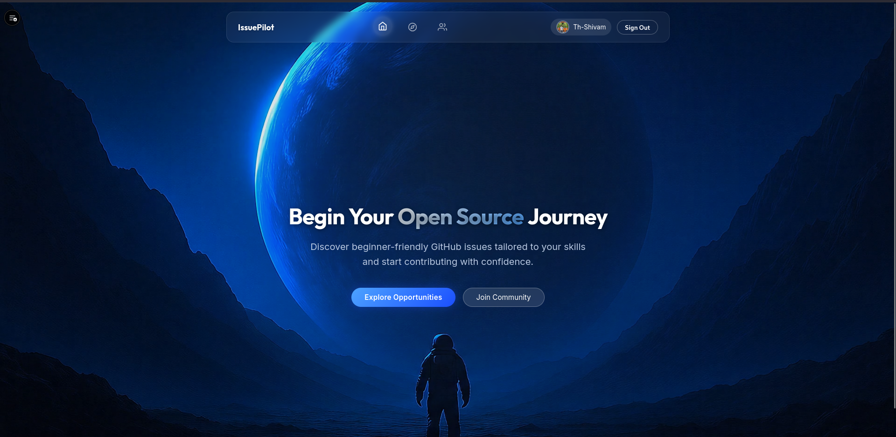
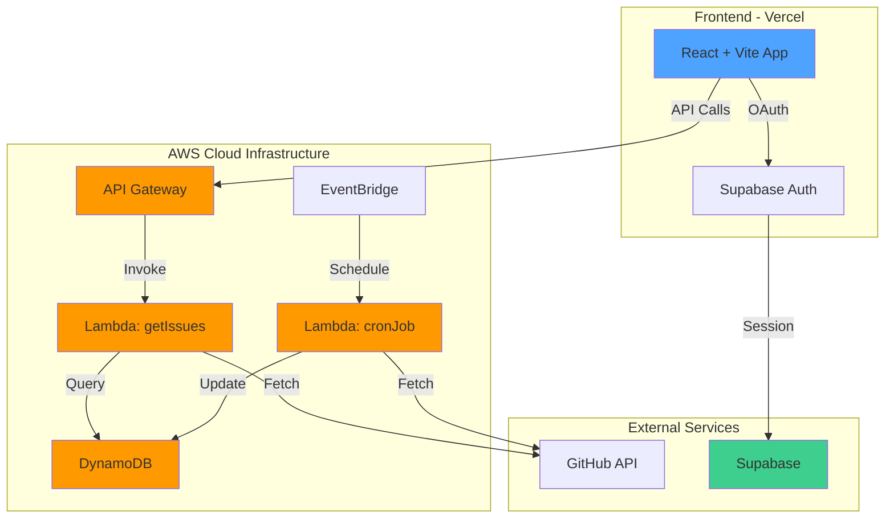

<div align="center">

# 🚀 IssuePilot

### Your Gateway to Open Source Contribution

*Discover beginner-friendly GitHub issues tailored to your skills and start contributing with confidence*

[](https://issuepilot-ten.vercel.app)
[](https://github.com/Th-Shivam/IssuePilot)
[](LICENSE)



</div>

---

## 📖 Table of Contents

- [✨ Features](#-features)
- [🏗️ Architecture](#️-architecture)
- [☁️ Cloud Infrastructure](#️-cloud-infrastructure)
- [🛠️ Tech Stack](#️-tech-stack)
- [🚀 Getting Started](#-getting-started)
- [📦 Deployment](#-deployment)
- [🔐 Authentication](#-authentication)
- [🎨 UI/UX](#-uiux)
- [📊 API Documentation](#-api-documentation)
- [🤝 Contributing](#-contributing)
- [📄 License](#-license)

---

## ✨ Features

### 🎯 Core Features

- **🔍 Smart Issue Discovery** - Find beginner-friendly issues across GitHub
- **🎚️ Advanced Filtering** - Filter by difficulty level and technology stack
- **🎓 GSoC Organizations Filter** - Discover issues from Google Summer of Code participating organizations
- **🔐 GitHub OAuth** - Secure authentication via Supabase
- **💬 Community Hub** - Join Discord & WhatsApp communities
- **🌙 Dark Mode** - Beautiful space-themed UI with glassmorphism
- **📱 Responsive Design** - Works seamlessly on all devices

### 🎓 GSoC Organizations Filter

IssuePilot highlights issues from organizations that have historically participated in Google Summer of Code (GSoC). This feature helps you:

- Discover projects with active mentorship programs
- Find beginner-friendly issues in GSoC-relevant repositories
- Explore organizations that value open-source contributions

**Important Disclaimer:**

- ⚠️ **Not a guarantee:** Contributing to GSoC organizations does NOT guarantee selection into the GSoC program
- 📝 **Selection criteria:** GSoC acceptance depends on your proposal quality, contribution history, communication with mentors, and competition
- 🎯 **Our goal:** We simply help you find relevant issues—your success depends on your effort and engagement
- 💡 **Best practice:** Contribute to projects you're genuinely interested in, regardless of GSoC status

The GSoC organizations list is manually curated and updated annually (around February-March).

### 🚀 Technical Highlights

- **Serverless Architecture** - AWS Lambda + API Gateway
- **Real-time Auth** - Supabase with GitHub OAuth
- **Automated Data Pipeline** - EventBridge scheduled cron jobs
- **Rate Limiting** - API Gateway throttling for security
- **CI/CD** - Automatic deployments via Vercel
- **Performance** - Optimized with React + Vite

---

## 🏗️ Architecture

### System Design



### Data Flow

1. **User Request** → Frontend (Vercel)
2. **API Call** → AWS API Gateway (with rate limiting)
3. **Lambda Execution** → Fetch from DynamoDB
4. **Response** → JSON data to frontend
5. **Cron Job** → EventBridge triggers Lambda every 12 hours
6. **Data Sync** → Fresh issues from GitHub API → DynamoDB

---

## ☁️ Cloud Infrastructure

### AWS Services Used

| Service | Purpose | Configuration |
|---------|---------|---------------|
| **Lambda** | Serverless compute for API & cron jobs | Node.js 18.x, 512MB RAM |
| **API Gateway** | RESTful API endpoint | Rate limiting: 100 req/s |
| **DynamoDB** | NoSQL database for issues | On-demand billing |
| **EventBridge** | Scheduled cron jobs | Runs every 12 hours |
| **CloudWatch** | Logging & monitoring | 7-day retention |
| **IAM** | Access management | Least privilege policies |

### Infrastructure Highlights

```
┌─────────────────────────────────────────────────┐
│  🌐 Frontend (Vercel)                           │
│  ├─ React 18 + Vite                             │
│  ├─ Supabase Auth                               │
│  └─ Auto-deploy on Git push                     │
└─────────────────────────────────────────────────┘
                      ↓
┌─────────────────────────────────────────────────┐
│  ☁️ AWS API Gateway                             │
│  ├─ REST API: /v1/Issues                        │
│  ├─ CORS enabled                                │
│  ├─ Rate limiting: 100 req/s, burst 200         │
│  └─ CloudWatch logging                          │
└─────────────────────────────────────────────────┘
                      ↓
┌─────────────────────────────────────────────────┐
│  ⚡ AWS Lambda Functions                        │
│  ├─ getIssues: Fetch issues by category         │
│  ├─ cronJob: Sync GitHub data                   │
│  └─ Timeout: 10s, Memory: 512MB                 │
└─────────────────────────────────────────────────┘
                      ↓
┌─────────────────────────────────────────────────┐
│  🗄️ DynamoDB                                    │
│  ├─ Table: Issues                               │
│  ├─ Partition Key: category                     │
│  └─ On-demand capacity                          │
└─────────────────────────────────────────────────┘
```

### Cost Optimization

- **AWS Free Tier**: 1M Lambda requests/month
- **Vercel Free Tier**: Unlimited deployments
- **Supabase Free Tier**: 500MB database, 50K monthly active users
- **Estimated Monthly Cost**: **$0** (within free tiers)

---

## 🛠️ Tech Stack

### Frontend


### Backend & Cloud


### Authentication & Database


### DevOps & Deployment


---

## 🚀 Getting Started

### Prerequisites

```bash
Node.js >= 18.x
npm >= 9.x
Git
AWS Account (for backend)
Supabase Account (for auth)
```

### Installation

1. **Clone the repository**

```bash
git clone https://github.com/Th-Shivam/IssuePilot.git
cd IssuePilot
```

2. **Install dependencies**

```bash
npm install
```

3. **Set up environment variables**

Create a `.env` file in the root directory:

```env
# Supabase Configuration
VITE_SUPABASE_URL=your_supabase_project_url
VITE_SUPABASE_ANON_KEY=your_supabase_anon_key

# AWS API Gateway
VITE_API_BASE_URL=your_api_gateway_url
VITE_API_URL=your_api_gateway_url
```

4. **Run development server**

```bash
npm run dev
```

Visit `http://localhost:5173` 🎉

---

## 📦 Deployment

### Frontend Deployment (Vercel)

1. **Push to GitHub**

```bash
git add .
git commit -m "Ready for deployment"
git push origin main
```

2. **Deploy to Vercel**

[](https://vercel.com/new/clone?repository-url=https://github.com/Th-Shivam/IssuePilot)

3. **Add Environment Variables in Vercel**

- `VITE_SUPABASE_URL`
- `VITE_SUPABASE_ANON_KEY`
- `VITE_API_BASE_URL`
- `VITE_API_URL`

4. **Deploy!** 🚀

### Backend Deployment (AWS)

See [AWS_DEPLOYMENT.md](docs/AWS_DEPLOYMENT.md) for detailed Lambda & API Gateway setup.

---

## 🔐 Authentication

### Supabase + GitHub OAuth

IssuePilot uses **Supabase** for authentication with **GitHub OAuth** provider.

#### Setup Steps:

1. **Create Supabase Project**
   - Visit [supabase.com](https://supabase.com)
   - Create new project
   - Copy URL and anon key

2. **Configure GitHub OAuth**
   - GitHub Settings → Developer settings → OAuth Apps
   - Create new OAuth app
   - Set callback URL: `https://your-project.supabase.co/auth/v1/callback`

3. **Enable in Supabase**
   - Authentication → Providers → GitHub
   - Add Client ID and Secret
   - Save

#### Features:

- ✅ Secure session management
- ✅ Automatic token refresh
- ✅ Protected routes
- ✅ User profile with GitHub avatar

---

## 🎨 UI/UX

### Design System

- **Theme**: Space-inspired dark mode
- **Colors**: 
  - Primary: `#4DA3FF` (Blue)
  - Secondary: `#8A2BE2` (Purple)
  - Background: `#0a0e27` (Dark Navy)
- **Typography**: Inter, system fonts
- **Effects**: Glassmorphism, gradients, smooth animations

### Key Pages

| Page | Route | Description |
|------|-------|-------------|
| **Landing** | `/` | Hero section with CTA |
| **Explore** | `/explore` | Browse & filter issues |
| **Community** | `/community` | Discord & WhatsApp links |
| **Login** | `/login` | GitHub OAuth authentication |

---

## 📊 API Documentation

### Base URL

```
https://t9gywgbya3.execute-api.us-east-1.amazonaws.com/v1
```

### Endpoints

#### GET `/Issues`

Fetch issues by category and tech stack.

**Query Parameters:**

| Parameter | Type | Required | Values |
|-----------|------|----------|--------|
| `category` | string | Yes | `Beginner`, `Medium`, `Hard` |
| `techStack` | string | No | Language name (e.g., `JavaScript`) |

**Example Request:**

```bash
curl "https://api-url/v1/Issues?category=Beginner&techStack=JavaScript"
```

**Example Response:**

```json
{
  "count": 25,
  "items": [
    {
      "id": "issue-123",
      "title": "Add dark mode toggle",
      "repository": "awesome-project",
      "difficulty": "Beginner",
      "techStack": "JavaScript",
      "url": "https://github.com/...",
      "labels": ["good first issue", "enhancement"]
    }
  ]
}
```

### Rate Limiting

- **Rate**: 100 requests/second
- **Burst**: 200 requests
- **Quota**: 10,000 requests/day

**Throttled Response:**

```json
{
  "message": "Too Many Requests"
}
```

HTTP Status: `429`

---

## 🤝 Contributing

We welcome contributions! Here's how you can help:

### Development Workflow

1. **Fork the repository**
2. **Create a feature branch**

```bash
git checkout -b feature/amazing-feature
```

3. **Make your changes**
4. **Commit with conventional commits**

```bash
git commit -m "feat: add amazing feature"
```

5. **Push to your fork**

```bash
git push origin feature/amazing-feature
```

6. **Open a Pull Request**

### Commit Convention

- `feat:` New feature
- `fix:` Bug fix
- `docs:` Documentation
- `style:` Formatting
- `refactor:` Code restructuring
- `test:` Adding tests
- `chore:` Maintenance

---

## 📄 License

This project is licensed under the **MIT License** - see the [LICENSE](LICENSE) file for details.

---

## 🙏 Acknowledgments

- **GitHub API** for providing issue data
- **Supabase** for authentication infrastructure
- **AWS** for serverless backend
- **Vercel** for seamless deployment
- **Open Source Community** for inspiration

---

## 📞 Contact

**Shivam Singh**

[](https://github.com/Th-Shivam)
[](https://linkedin.com/in/your-profile)
[](mailto:your.email@example.com)

---

<div align="center">

### ⭐ Star this repo if you find it helpful!

**Made with ❤️ and ☁️ by Shivam Singh**


</div>
